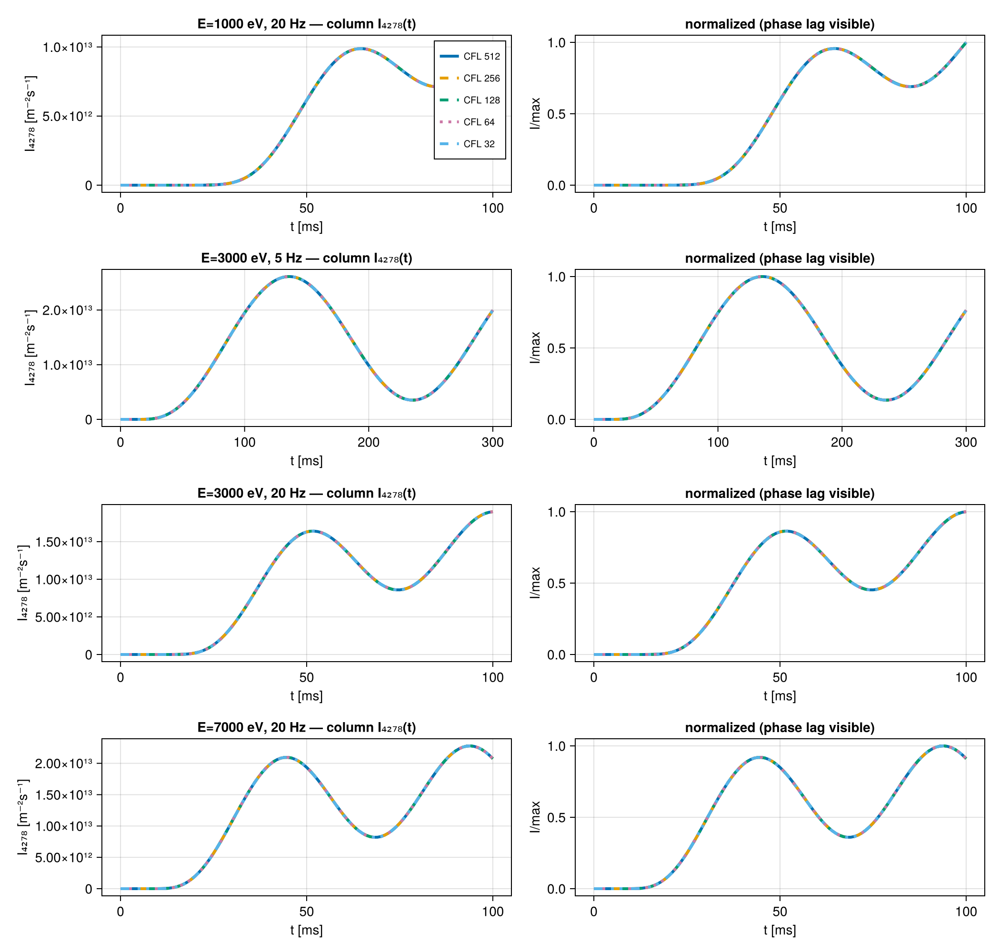
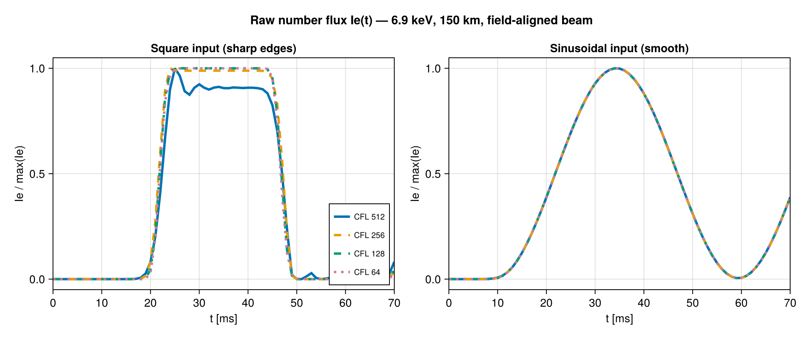
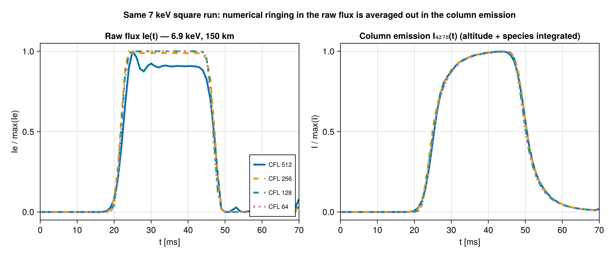
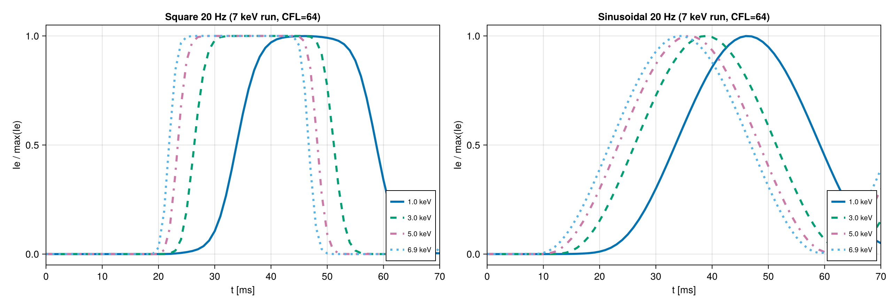

# [Choosing the CFL number](@id CFL)

For time-dependent simulations, the Crank-Nicolson solver advances the electron flux on an
*internal* time step `dt_internal` that is finer than the output `dt`. The `CFL_number` you
pass to [`TimeDependentMode`](@ref) sets how much finer. A larger `CFL_number` means fewer,
coarser internal steps — cheaper, but in principle less accurate in time.

This page explains how that trade-off plays out in practice and why AURORA tolerates
surprisingly large CFL numbers.

!!! tip "Short answer"
    - **`CFL_number = 128` is a safe default** for essentially every case.
    - For **smooth modulation** (e.g. [`SinusoidalFlickering`](@ref)) you can go to **256–512**
      with no visible effect, at any energy.
    - Only drop **below 128** if you analyse the **raw `Ie` flux** of **high-energy
      (≳ 5 keV)** electrons driven by an input with **sharp edges** (sudden onsets,
      [`SquareFlickering`](@ref)).

## What the CFL number controls

The internal step is `dt_internal = dt / CFL_factor`, where the refinement factor is

```math
\texttt{CFL\_factor} = \left\lceil \frac{v_{\max}\,\Delta t}{\texttt{CFL\_number}\cdot\Delta z_{\min}} \right\rceil .
```

Here ``v_{\max}`` is the speed of the highest-energy electrons and ``\Delta z_{\min}`` the
smallest (bottom-of-grid) spacing. The resolved grid is a [`RefinedTimeGrid`](@ref); see also
[Internals](@ref) for the Crank-Nicolson discretization.

Two consequences matter:

- **Cost scales with `CFL_factor`.** Doubling `CFL_number` roughly halves the number of
  internal steps, and therefore the runtime.
- **Stability is never the issue.** Crank-Nicolson is unconditionally stable, so a large
  `CFL_number` will not make the simulation blow up. The only question is *accuracy* — whether
  the coarser time step distorts the result.

## Why large CFL numbers are usually safe

Crank-Nicolson is non-dissipative, so on a genuinely under-resolved sharp feature it can
*overshoot* or *ring*. What makes AURORA forgiving is that the model damps those numerical
oscillations through two stages:

1. **Transport dispersion (physics).** Electrons of different energies and pitch angles travel
   at different speeds, so a sharp on/off modulation imposed at the top arrives *spread out in
   time* at the emission altitude. The sharp edges — the only thing a coarse time step gets
   wrong — are physically smeared before they ever produce light.
2. **Observable integration (analysis).** Column-integrated quantities sum over altitude and
   over many excitation processes. A localized numerical wiggle in one altitude/energy bin is
   averaged against many others and largely cancels.

The result is that the temporal *high-frequency content* a coarse step would mishandle is
mostly gone by the time you look at a physical observable. The next sections show this directly.

## Smooth modulation: the CFL number barely matters

For a smooth sinusoidal flicker, the coarse and fine solutions are indistinguishable — even
at `CFL_number = 512`, the column 4278 Å emission deviates by **< 0.1 %** with a phase lag
**< 0.2 ms**, across 1–7 keV and 5–20 Hz:



A smooth sinusoid simply has very little high-frequency content for the coarse internal step
to misrepresent.

## Sharp edges: where the CFL number shows up

A [`SquareFlickering`](@ref) input is the stress test: its instantaneous on/off transitions
carry arbitrarily high frequencies. Looking at the **raw electron flux** at a single altitude,
energy and (field-aligned) beam — the least-processed quantity — the coarsest CFL numbers now
visibly **overshoot and ring** at the edges. The panel on the right is the control: the *same*
energy and altitude with a *smooth* input, where every CFL number overlaps again.



The lesson is that it is the **sharp edges, not the high energy**, that coarse time-stepping
cannot resolve. A 7 keV beam with a smooth drive is fine even at `CFL_number = 512`.

## ...but analysed quantities hide it

The ringing above lives in the raw flux of a single high-energy bin. The quantities you
normally analyse are integrated, and the integration averages it away. The figure below shows
the *same* 7 keV square run: the raw flux (left) rings, while the column 4278 Å emission
(right) is smooth and effectively CFL-independent.



The mechanism is the transport dispersion of section [Why large CFL numbers are usually
safe](@ref). Lower-energy electrons arrive progressively later and more spread out, so their
contribution to a given altitude is smooth; summed over the column, they dominate and wash out
the localized high-energy ringing:



Quantitatively, for the 7 keV square case the worst-case deviation from a converged reference
drops from **~15 %** in the raw flux to **~6 %** in the column emission at `CFL_number = 512`,
and the modulation *amplitude* is preserved to better than **0.3 %**. `CFL_number = 128`
brings even the raw-flux error to ≲ 5 %.

## Choosing a value

| Input character | Quantity analysed | Reasonable `CFL_number` |
|-----------------|-------------------|-------------------------|
| Smooth modulation (sinusoidal), any energy | any | up to **512** |
| Sharp edges (square / step), ≲ 3 keV | column emission | up to **512** |
| Sharp edges (square / step), ≲ 3 keV | raw flux | ~**256** |
| Sharp edges, ≳ 5 keV | column emission | **256** (~7 %), **128** clean |
| Sharp edges, ≳ 5 keV | **raw flux** | **≤ 128** |

`CFL_number = 128` is the single value that stays accurate across every combination tested,
which is why it is a good default.

!!! note "These numbers are illustrative"
    The thresholds above come from a specific test setup (a single atmosphere and grid). The
    qualitative behaviour is general, but exact percentages depend on the atmosphere, grid
    resolution, and energy range. When in doubt for a new regime, run a quick convergence check:
    halve `CFL_number` and confirm the quantity you care about does not change meaningfully.

!!! warning "Large apparent errors during a sudden onset"
    If you compare a coarse and a fine run as a *relative* error during a step turn-on — while
    the signal is rising from zero by orders of magnitude — you can see very large percentages.
    This is a metric artifact: a sub-millisecond timing difference divided by a tiny,
    fast-growing value. Measured against the signal's full scale, the same difference is only a
    few percent. Coarse CFL shifts timing by a fraction of a millisecond and rounds sharp
    features by a few percent; it does not corrupt the waveform.
