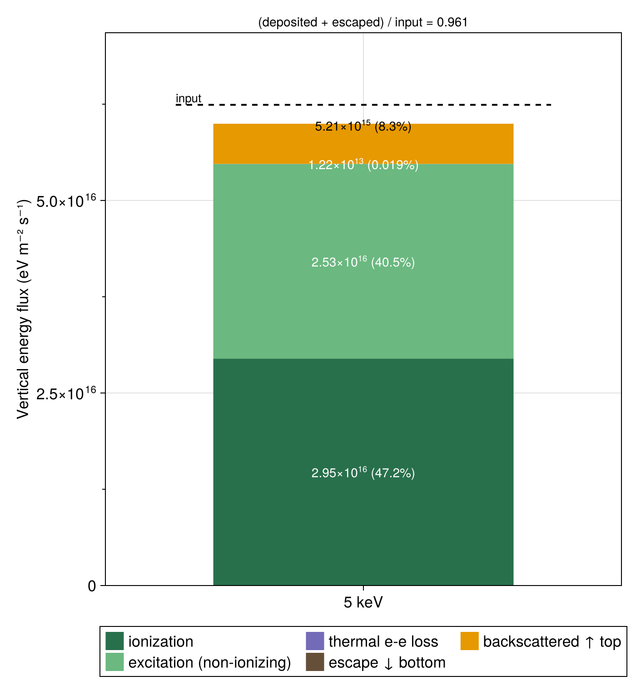

# [Output & data](@id Output)

```@meta
CurrentModule = AURORA
```

[`run!(sim)`](@ref run!) writes all of a simulation's output into its save directory
(`sim.output.savedir`). Nothing is written during construction or [`initialize!`](@ref). 
The format is split by job:

| Format | Used for |
|--------|----------|
| **NetCDF** (`.nc`) | N-dimensional array data (fluxes, atmosphere, analysis)    |
| **JLD2** (`.jld2`) | the full Julia `AuroraModel` (species + physics matrices)  |
| **TOML** (`.toml`) | scalar parameters, for quick inspection                    | 

## Directory layout

```
savedir/
├── config.toml               # scalar parameters (grid limits, dt, E_max, version, commit)
├── inputs/
│   ├── atmosphere.nc         # neutral & electron density / temperature profiles
│   └── physics_state.jld2    # full AuroraModel (species + physics matrices) — Julia reload
├── simulation_data.nc        # electron flux output (appended per solver loop, crash-safe)
└── analysis/                 # derived quantities, written by the make_* functions
    ├── volume_excitation.nc
    ├── column_excitation.nc
    ├── Ie_top.nc
    ├── currents.nc
    ├── heating_rate.nc
    ├── psd.nc
    └── energy_budget.toml
```

`config.toml`, `inputs/`, and `simulation_data.nc` are written by `run!`. The `analysis/`
files are written separately by the post-processing functions (see [Analysis](@ref)).

## `simulation_data.nc`

The main output. The `time` dimension is appended to after each solver loop.

| Variable | Dims | Units | Notes |
|----------|------|-------|-------|
| `altitude` | `(altitude,)` | m | altitude grid centers |
| `pitch_angle` | `(pitch_angle,)` | 1 | cosine of pitch angle, beam center (μ) |
| `energy` | `(energy,)` | eV | energy bin centers |
| `time` | `(time,)` | s | save-cadence time axis |
| `energy_edges` | `(energy_bounds,)` | eV | energy bin edges |
| `mu_lims` | `(pitch_angle_bounds,)` | 1 | μ bin boundaries |
| `dE` | `(energy,)` | eV | energy bin width |
| `beam_weight` | `(pitch_angle,)` | sr | solid-angle beam weight |
| `Ie` | `(altitude, pitch_angle, time, energy)` | m⁻² s⁻¹ | electron **number** flux |
| `Ie_input` | `(pitch_angle, time_input, energy)` | m⁻² s⁻¹ | input precipitation (boundary condition) |
| `time_input` | `(time_input,)` | s | time axis for `Ie_input` |

Global attributes: `aurora_version`, `commit_hash`, `creation_time`.

!!! warning "`Ie` is a number flux, not a differential flux"
    `Ie` is already integrated over each energy bin **and** over each beam's solid angle, so
    its units are m⁻² s⁻¹ (electrons per m² per second, per bin, per beam) — *not*
    eV⁻¹ m⁻² s⁻¹ sr⁻¹. To obtain a differential flux, divide by `dE` and
    `beam_weight` (both saved in the file).

!!! note "`Ie_input` vs `analysis/Ie_top.nc`"
    `Ie_input` (here) is the **boundary condition** fed into the simulation. `analysis/Ie_top.nc`
    (written by [`make_Ie_top_file`](@ref)) is the simulation **output** at the top altitude
    slice — it contains *all* beams, including the upward (backscattered) flux. They are
    different quantities; see [`load_Ie_top`](@ref).

## `inputs/`

- `atmosphere.nc` — altitude grid, electron density `ne` and temperature `Te`, and one number
  density variable per neutral species (`nN2`, `nO2`, `nO`, …).
- `physics_state.jld2` — the complete [`AuroraModel`](@ref), including the materialized
  scattering and cascading matrices. Reload it in Julia with [`load_model`](@ref), i.e.
  `model = load_model("my_run")`.

```@docs; canonical=false
load_model
```

## Controlling output — [`AuroraOutputManager`](@ref)

`AuroraSimulation` takes an [`AuroraOutputManager`](@ref) as its third argument, which holds
all output options:

```julia
out = AuroraOutputManager("my_run"; overwrite = false, compress = true)
sim = AuroraSimulation(model, flux, out; mode = TimeDependentMode(duration = 0.5, dt = 0.001))

# Convenience: passing a plain String wraps it in an AuroraOutputManager with the defaults
sim = AuroraSimulation(model, flux, "my_run"; mode = SteadyStateMode())
```

- `overwrite = false` — `run!` errors if `simulation_data.nc` already exists in `savedir`
  (pass `overwrite = true` to allow replacing it).
- `compress = true` — zlib compression (`deflatelevel = 4`) on all NetCDF variables.
- `savedir` may be a relative or absolute path and is created by `run!`. An empty or
  whitespace `savedir` falls back to `backup/<yyyymmdd-HHMM>/` in the current working directory.

## Reading results

In Julia, you can use the following loader helpers (see [Analysis](@ref) for the result types):

```julia
result = load_results("my_run")                # SimulationResult: Ie, t, h_atm, E_centers, E_edges, dE, mu_lims
vol    = load_volume_excitation("my_run")      # after make_volume_excitation_file
top    = load_Ie_top("my_run")                 # after make_Ie_top_file
```

`load_results` loads `Ie` eagerly, which would result in out of memory issues for very
large simulation results. To prevent this, it will error if the allocation would exceed `max_bytes`
(default 2 GiB). You can raise the limit or disable it entirely by passing the keyword argument `max_bytes = Inf`. 

Because `simulation_data.nc` is saved as a NetCDF, you can read only the
subset you are interested in without loading the full file into memory. 
You can do this manually, but for simple cases you can also use the 
`tidx`/`zidx`/`μidx`/`eidx` keyword arguments of `load_results` to pick a subset:

```julia
# Load only the first 100 time steps and the first 3 energy bins
res = load_results("my_run"; tidx = 1:100, eidx = 1:3)
res.Ie   # [n_z, n_μ, 100, 3]
res.t    # time axis for those steps (s)
```

If what you want to process is still too large to fit in memory even with selectors, you can
stream `Ie` chunk by chunk. This is actually the approach used internally by the analysis
functions. You can use `load_coordinates` (which reads everything *except* `Ie`) together with
`AURORA.foreach_Ie_time_chunk`:

```julia
# Load only the coordinate vectors (cheap — does not read Ie)
coords = load_coordinates("my_run")

# Stream Ie in time chunks that each stay under 512 MiB
# Note: foreach_Ie_time_chunk is an internal helper and may change in future releases.
AURORA.foreach_Ie_time_chunk("my_run"; max_bytes = 512 * 1024^2) do Ie_chunk, t_range
    # Ie_chunk is [n_z, n_μ, length(t_range), n_E]
    process(Ie_chunk, coords.t[t_range])
end
```

Because the output files are standard NetCDF, they are also readable from Python (`xarray`,
`netCDF4`), MATLAB, or any other NetCDF-capable tool.

## Analysis outputs

The `analysis/` files are produced on demand by the post-processing functions, each reading
`simulation_data.nc` (and, where needed, `inputs/atmosphere.nc`). See
[Post-Processing & Analysis](@ref Post-Processing) for usage and the [Analysis](@ref) API page
for the per-function compatibility table.

### Energy budget

[`energy_budget`](@ref) reports where the precipitating energy flux ends up — neutral
excitation and ionization, thermal-electron heating, backscatter out of the top, absorption
at the bottom of the grid — and how much of it the run fails to account for:

```julia
budget = energy_budget("my_run")   # prints a summary and returns an EnergyBudget
budget.albedo                      # escaping / incoming energy flux
budget.bottom_escape               # energy absorbed at the floor of the grid
budget.residual_fraction           # unaccounted fraction; small and positive on a good grid
```

On a time-dependent run a single slice does not balance, because energy is still in transit.
Pass `trange` to integrate the balance over time instead, which closes for a transient that
starts and ends at rest; the result then holds energies (eV m⁻²) and carries the interval it
covers in `budget.interval`:

```julia
budget = energy_budget("my_run"; trange = :)        # all slices
budget = energy_budget("my_run"; trange = 10:40)    # part of the run, by slice index
budget = energy_budget("my_run"; trange = (0.0, 0.05))  # part of the run, by time (s)
budget = energy_budget("my_run"; tidx = 25)         # one slice, by index
budget = energy_budget("my_run"; t = 0.03)          # one slice, the one nearest 0.03 s
```

[`make_energy_budget_file`](@ref) saves the same result as `analysis/energy_budget.toml`, a
few hundred bytes that outlive the multi-gigabyte `simulation_data.nc`:

```julia
make_energy_budget_file("my_run")
budget = load_energy_budget("my_run")
```

With a Makie backend loaded, [`plot_energy_budget`](@ref) draws the same budget as a stacked
bar against a dashed input line, each segment labelled with its energy flux and its share
of the input:

```julia
using CairoMakie
fig = plot_energy_budget(budget; label = "5 keV")

# Several runs side by side, one bar each
fig = plot_energy_budget([load_energy_budget(dir) for dir in run_dirs];
                         labels = ["2 keV", "5 keV", "10 keV"])
```


